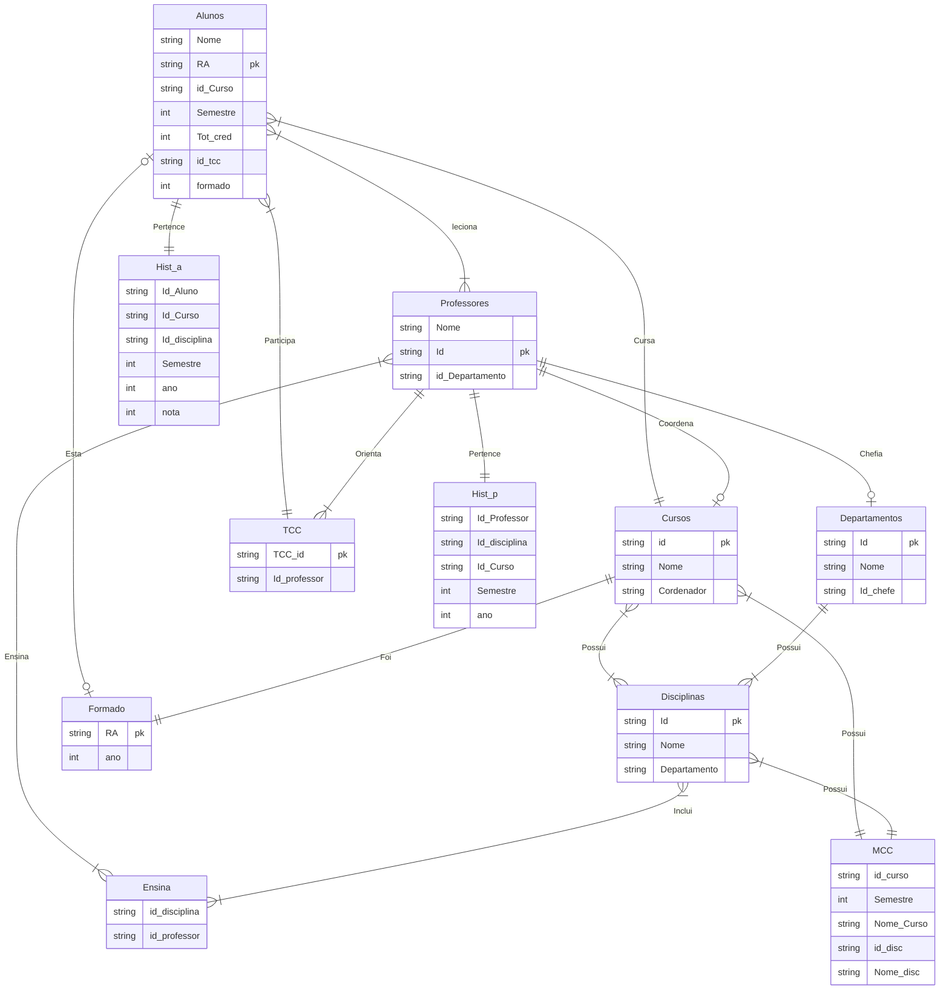

# BancoDados2
Trabalho em grupo - Topicos avancados de banco de dados
# ProjetoDB
### Integrantes:  

# Como utilizar o código
Para utilizar o código, o usuário deverá copiar o código das tabelas e das inserções e colocar no banco de dados, após isso, copiar a querie que deseja(posicionadas ao fim do código) e colocar no banco de dados, estão presentes os códigos: Criação das tabelas, Inserção de dados nas tabelas e as queries solicitadas. As tabelas criadas são as de Alunos, Professores, Cursos, TCC, Departamento, Disciplinas, Matriz curricular de cursos, Histórico de aluno e professor, Formado (Quais alunos já se formaram) e Ensina (as matérias que um professor ensina). Os dados inseridos foram feitos com auxílio do site Mockaroo. As queries solicitadas estão disponíveis ao fim do código e mostram os dados requisitados pelo usuário. O código foi realizado e testado devidamento no site CockroachDB.
# Diagrama Relacional

